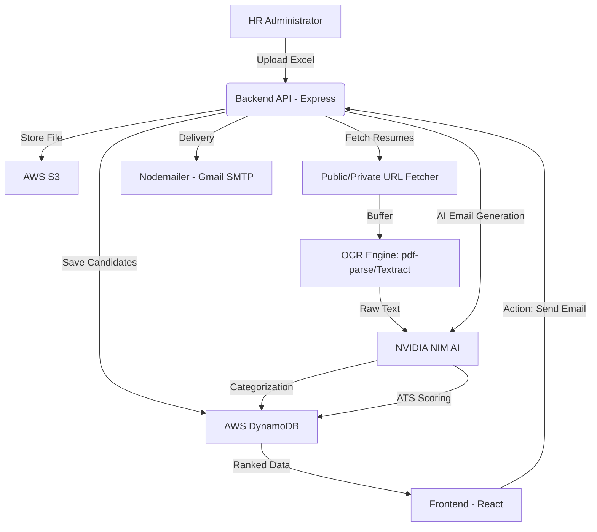

# Detailed Product Requirements Document (PRD): PreciseHire

## 1. Executive Summary
**PreciseHire** is an enterprise-grade, AI-native recruitment orchestration platform. It is designed to modernize the legacy "Excel-to-Candidate" workflow by automating resume parsing, skill-based categorization, and multi-dimensional ranking using the **NVIDIA NIM (Llama 3.1 70B)** engine. The platform features a premium, B2B SaaS light theme designed for maximum productivity and clarity.

---

## 2. System Architecture & Flow

### 2.1 High-Level Architecture

### 2.2 Core Data Flow (The "Screening Pipeline")
1.  **Ingestion**: Multi-threaded parsing of `.xlsx` files using the `xlsx` library with case-insensitive column mapping.
2.  **Hydration**: Each candidate entry is complemented by fetching their external resume PDF.
3.  **Extraction**: PDF text is extracted. If the PDF is a scanned image, the system triggers **AWS Textract** for high-fidelity OCR.
4.  **Contextual Ranking**: The Llama 3.1 model performs a "Semantic Match" against the Job Description (JD), looking for latent skills that keyword-based ATS systems often miss.

---

## 3. Functional Requirements

### 3.1 Module: Admin Data Management
- **Bulk Upload**: support 10MB+ Excel files with thousands of rows.
- **Validation**: Strict validation for required fields (Name, Email, Resume Link).
- **Preview Engine**: Real-time rendering of the first 5 rows to confirm mapping accuracy before full ingestion.

### 3.2 Module: AI Analysis & Categorization
- **Role Bucket Classification**: AI assigns candidates to buckets (e.g., UI/UX, Backend, DevOps) based on work history.
- **Smart Filtering**: HR can select a bucket, and the AI will only score candidates relevant to that specific role, saving compute tokens.
- **Experience Mapping**: Extraction of years of experience and seniority level.

### 3.3 Module: Custom Weightage Benchmarking
- **Linked Sliders**: A dynamic UI allowing HR to balance "Skills Match" vs "Experience" vs "Profile Quality".
- **Real-time Re-ranking**: Adjusting a slider triggers an immediate recalculation of the `weighted_score` (0-100).

### 3.4 Module: Pipeline Orchestration
- **Kanban Board**: Drag-and-drop movement across rounds (ATS -> Interview -> Technical -> Verbal -> Selected).
- **History Tracking**: Status updates are persisted in DynamoDB with timestamps.
- **Customization**: Ability to add bespoke rounds (e.g., "Culture Fit") mid-cycle.

### 3.5 Module: Automated Communication
- **Personalized Email Generation**: AI drafts emails referencing specific strengths mentioned in the candidate's resume.
- **Transactional Messaging**: Integrated Nodemailer with Gmail SMTP for reliable delivery of:
  - Interview Invitations
  - Assessment Links
  - Round Clearance Notifications
  - Professional Rejection Emails
  - Official Offer Letters
- **Rate Limit Protection**: Built-in 1100ms delay between bulk sends to ensure SMTP stability.

---

## 4. Technical Specifications

### 4.1 Frontend (React + Vite)
- **Design System**: Professional B2B SaaS Light Theme (#ffffff surface, #f8f9fa background).
- **State Management**: Local context and persistent `localStorage` for cross-page session maintenance (`precisehire_jobId`).
- **Styling**: Tailwind CSS v4 using a professional shadow-based depth system.
- **Icons**: Lucide-React for meaningful visual cues.

### 4.2 Backend (Node.js + Express)
- **Middleware**: `multer` for memory storage, `cors` for secure frontend communication.
- **AI Integration**: Custom wrapper for NVIDIA NIM OpenAI-compatible SDK with batching logic.
- **Email Service**: Migration from AWS SES to Nodemailer SMTP for improved developer experience and delivery flexibility.
- **Resilience**: Timeout handling for heavy resume downloads (20s timeout) and automatic retries for AI calls.

### 4.3 Database Schema (DynamoDB)
- **Table: `precisehire_jobs`**
  - PK: `jobId` (UUID)
  - Fields: `title`, `description`, `skills` (Array), `weightage` (Object), `totalCandidates`, `status`, `createdAt`.
- **Table: `precisehire_candidates`**
  - PK: `candidateId` (UUID)
  - SK: `jobId` (Reference)
  - Fields: `name`, `email`, `resumeLink`, `resumeText` (max 5,000 chars), `role`, `skills_score`, `weighted_score`, `rank`, `currentRound`, `status`.

---

## 5. UI/UX Page Requirements

### 5.1 Dashboard
- **Real-time Analytics**: Total candidates processed vs. Avg ATS Score.
- **Active Cycles**: Quick-access cards for ongoing recruitment drives.
- **AI Insights**: A dedicated panel providing narrative feedback on the talent pool quality.

### 5.2 Screening Console
- **Rich Text Entry**: Large area for detailed JDs.
- **Tag System**: Input for required keywords/skills.
- **Constraint Handling**: Visual warnings if weightage sliders don't total 100%.

### 5.3 Ranking Leaderboard
- **Gamified Ranking**: Rank badges for all candidates.
- **Status Pills**: Color-coded badges for Skills%, Experience%, and Quality%.
- **Action Modal**: Integrated modal for one-click interview scheduling and assessment distribution.

---

## 6. Security & Compliance
- **Data Isolation**: Multi-tenant architecture (logical isolation via `jobId`).
- **PII Protection**: Truncation of resume text in logs and limited storage of sensitive fields.
- **Secure Emailing**: TLS-secured SMTP communication for all candidate outreach.

---

## 7. Performance KPIs
- **Throughput**: Process 50 candidates (Fetching + OCR + AI Scoring) in < 2 minutes.
- **Accuracy**: > 90% correlation between AI role assignment and manual recruiter verification.
- **Rate Limiting**: Intelligent 1.1s throttling for email sends to avoid SMTP blocking.

---

## 8. Development Roadmap

### Phase 1 (Core)
- [x] Excel parsing & S3 integration.
- [x] Llama 3.1 Scoring Logic.
- [x] Shortlist UI.

### Phase 2 (Automation)
- [x] Nodemailer Gmail SMTP Integration.
- [x] Kanban Pipeline Management.
- [x] Professional SaaS Light Theme Redesign & Navbar UI Refinement.

### Phase 3 (Testing & Reliability)
- [x] Extract core logic into pure utility functions (`excelMapper`, `scoring`, `aiParser`).
- [x] Install and configure Jest unit testing with native ES Modules support.
- [x] Configure automated GitHub Actions CI/CD workflow.

---

## 9. Testing & CI/CD Specification

### 9.1 Unit Testing Framework (Jest)
- Jest is configured in the backend as a development dependency.
- Test script executes using Node.js experimental VM modules to natively support ES Modules (`import`/`export` syntax) without Babel transpilation.
- Option `--no-watchman` is enabled to prevent file-watching permission errors on restricted local development systems.

### 9.2 Test Coverage
- **Excel Mapping (`excelMapper.test.js`)**:
  - Valid and alternate case-insensitive column headers (e.g. `Candidate Name`, `Email Address`, `CV`, `Mail`).
  - Edge cases (missing names, missing emails, empty arrays, non-object inputs).
  - Sanitization rules (trimming trailing and leading whitespaces).
- **Scoring Engine (`scoring.test.js`)**:
  - Verification of mathematical weighted score calculations against customized slider configurations.
  - Zero-weightage fallback logic (arithmetic average score calculations).
  - Coercion handling of string-based scoring values to numbers.
- **AI Response Parser (`aiParser.test.js`)**:
  - Text cleanup and JSON structure extraction (objects/arrays) from raw LLM responses.
  - Substring matching for JSON enclosed within markdown blocks.
  - Error assertion checks for malformed, unparseable, or missing JSON patterns.

### 9.3 GitHub Actions CI/CD Pipeline
- Trigger rules: Runs on any `push` or `pull_request` targeting the `main` branch.
- Execution steps:
  1. Checks out repository code.
  2. Provisions Node.js 20 environment with npm package caching enabled.
  3. Installs backend dependencies cleanly (`npm ci`).
  4. Runs unit test suite (`npm test`).

